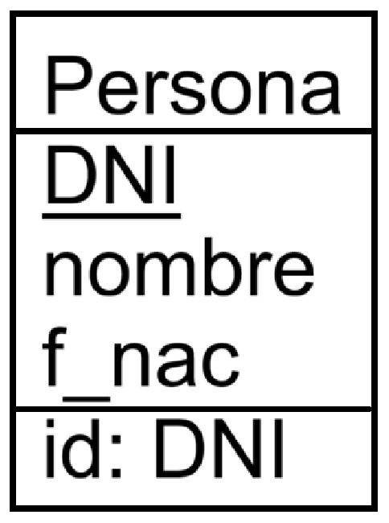
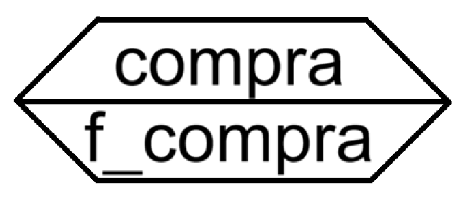
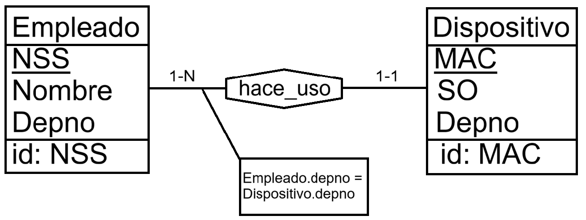
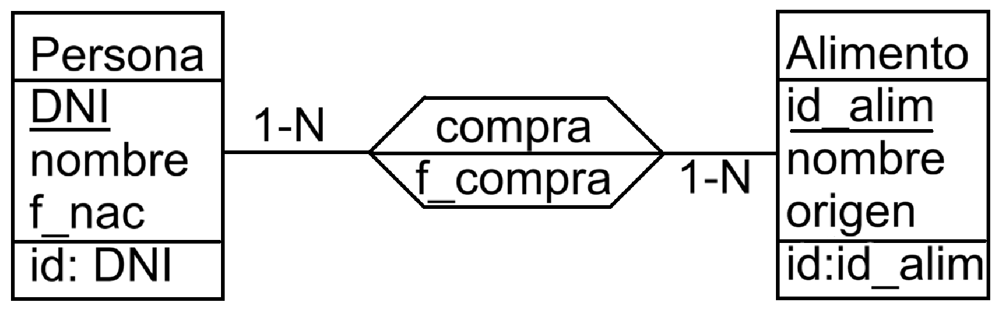

# Entidad-Relación

## Teoría 
### Entidad: 
- "Cosa" a representar en nuestra base de datos.
  * `Ejemplo:` `Persona`

- **Tipo de entidad**: igual que las clases pueden heredar, las entidades pueden ser superentidads o subentidad.
  * `Ejemplo:` Persona, puede ser Vendedor o Comprador.

- **Atributo**: propiedades de una entidad.
  * `Persona: DNI, nombre, f_nac`.

- **Identificador**: atributo único para cada entidad. (PRIMARY KEY).
  * Debe ir subrayado en los atributos.
  * `Ejemplo:` `Persona: _DNI_, nombre, f_nac`.

### Entidad Débil:
- Entidad que no puede existir sin otra.
  * `Ejemplo:` `Hotel` y `Habitacion`
    * Una `Habitacion` se puede repetir en distintos hoteles, por tanto un identificador `nro_habitacion` no es suficiente.
    * El identificador de la entidad `Habitacion` debe ser `id_hotel` + `nro_habitacion`.

### Relación: 
- Conexión o asociación entre dos entidades.

- **Cardinalidad**: de una entidad E en una relación R.
  * **Mínima**: número mínimo de veces que una E participa en R. 
  * **Máxima**: número máximo de veces que una E participa en R.
  * `Ejemplo: Comprador - 1-N - Compra - 1-N - Alimento`  
  Una `Comprador` puede comprar 1 o varios `Alimento` y un `Alimento` puede ser comprado por 1 o varias `Comprador`.

- **Atributos**: atributos que por su naturaleza no pueden ponerse en una entidad ya que dependen de la relación.
  * `Ejemplo: Comprador - Compra - Alimento`  
  Se quiere registrar la fecha en la que el `Comprador` compró el alimento.  
  No puede estar en `Comprador` ya que un `Comprador` puede comprar varios `Alimento` en días diferentes.  
  No puede estar en `Alimento` ya que uno (o varios) `Comprador` puede comprar el `Alimento` en días diferentes.

- **Relaciones *superentidad*-*subentidad* | *subentidad-subentidad***:
  * Una *subentidad* puede estar relacionada con su *superentidad* 
  * Una *subentidad* puede estar relacionada con su *hermana*.
  * `Ejemplo:`
    * La forma más clara de verlo es con `Empleado` `Encargado` y `Jefe`.
    * `Encargado` y `Jefe` heredan de `Empleado` ya que ambos son también `Empleado` en la empresa.
    * `Encargado` tiene una relación `encarga_de` con `Empleado`.
    * `Jefe` tiene una relacion `supervisa` con `Encargado`.

- **Auto-relaciones**:
  * Una entidad puede estar relacionada con sí misma.
  * `Ejemplo:`
    * `Persona` se relaciona con otra `Persona` con la relación `enamora_de` con cardinalidades 1-1, a no ser que sea un putero.

## Práctica

### Entidades
- Se representan en cuadrados.
- Suelen tener 3 "filas".
  * Nombre
  * Atributos
  * Id
- `Ejemplo:`   
  
- Casos en los que no tiene tres filas:
  * Es una especialización de otra y solo tiene atributos extra, por tanto no tendría identificador ya que reside en la entidad superior.
  * Es una generalización de varias y solo tiene nombre.

### Entidades Débiles
- Para denotar que una entidad es débil de otra, para la fila del id se utiliza:  
  

### Relaciones
- Se representan en hexágonos.
- Suelen tener una única fila.
  * Puede tener dos en caso de que presente atributos de relación.
- `Ejemplo:`   
  

- **Restricciones**:
  * Si para una relación ha de darse que un `atributo` valga `x`. 
  * Se denota con una línea saliente de la línea que conecta la entidad con la relación hacia un cuadrado en el que está la restricción.
  * `Ejemplo:`  
    

### Cardinalidades
- Se ponen encima de las líneas que unen las entidades con la relación.
- Formato: 1-1 | 1-N | 0-1 | 0-N
- `Ejemplo:`  
  

### Herencia
- Se representa mediante triángulos.
- Se une con líneas la entidad al triángulo.
- La *superentidad* conecta con el pico del triángulo.
- Las *subentidad* conectan desde el lado opuesto del pico al que se conectó la *superentidad*.
- Explicar cómo es la notación.
- Para denotar que la *superentidad* es abstracta se utiliza una doble raya (o una más gruesa) hacia el triángulo.
- Para denotar que la *subentidad* tiene que ser una u otra se denota con un arco que engloba las líneas que salen del triángulo hacia las subentidad.
- `Ejemplo:`  
  

### Extras
- Si para dos *subentidades* `B y C` que hereden de una misma *superentidad* `A` existen dos relaciones direntes con `D`, sin problema se conecta una a cada una, pero hay que tener cuidado y no generar redundancia creando una relacion `A-D` que signifique lo mismo que las otras.
  * `Ejemplo:`
    * `Universidad U` | `Persona P` → `Alumno A` y `Maestro`  
      * `Acc_Wi-fi`: `U-P`
      * `VerNomina`: `U-M`
      * `Matricula`: `U-A`

  
